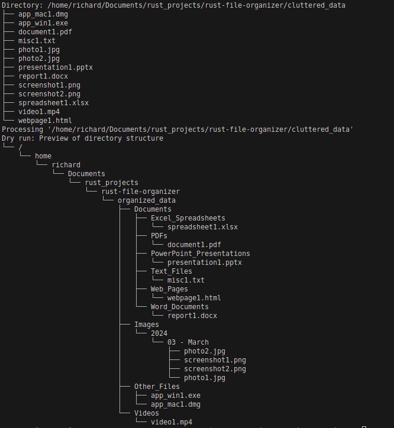

# Plexisort

Plexisort is a command-line tool designed to organize your files based on metadata. It allows for flexible source and destination directory settings, supports dry-run operations for safe previews of potential changes, and even offers an undo functionality for reversing the last set of file movements.

## Motivation

The **Plexisort** project began out of necessity and curiosity. Like many, I was grappling with a cluttered Downloads folder, consisting of files accumulated over time. This clutter made it difficult to locate important documents. I also had quite a lot of images and wanted ot organize them by date.

At about the same time, I started to learn Rust, and I was eager to put my new found power to the test. **Plexisort** emerged as the perfect project to address both my personal need for a cleaner digital workspace and my professional desire to become better at Rust.

In sharing Plexisort, I hope to not only provide a solution to a common problem but also inspire others to embark on their own learning journeys. Whether it's tackling digital clutter or exploring a new programming language, the essence of Plexisort is about embracing challenges and turning them into opportunities for growth.


## Version
0.1.0

## Features
- **Custom Config File**: Use a custom configuration (toml) file to specify operational parameters.
- **Source Directory**: Set one or more source directories for the organization process.
- **Destination Directory**: Define a specific destination directory for organized files.
- **Dry Run**: Execute the tool in a mode that shows what would be done without making any changes.
- **Undo**: Revert the last set of changes made by the tool.

## How to Use
1. **Installation**: Ensure you have Rust installed on your system. Clone this repository and build the project using `cargo build --release`.
2. **Running**: Execute the tool with `cargo run -- [OPTIONS]`. The following options are available:
   - `-c, --config <FILE>`: Sets a custom config file.
   - `--source <SOURCE_DIR>`: Sets the source directory(s). Multiple directories can be specified.
   - `--destination <DEST_DIR>`: Sets the destination directory.
   - `--dry-run`: Runs the organizer without making any changes.
   - `--undo`: Reverts the last set of file movements.

## Building the Configuration
If not using a configuration file, the tool requires at least the source and destination directories to be specified through command-line options.

## Config File Example
You can use a `config.toml` file like this for the configuration option:

```toml
source_directories = ["path/to/cluttered_data"]
destination = "organized_data/organized"
```

## Example Command using the config.toml file
```bash
cargo run -- --config config.toml
```


## Example Command using source and destination paths
```bash
cargo run -- --source /path/to/source --destination /path/to/destination
```

This will organize files from `/path/to/source` to `/path/to/destination` based on their metadata.

Visual Examples:

## Dry run mode creates a preview of the organized folder without making any changes
```bash
cargo run -- --config config.toml --dry-run=true
```


## Folder Layout Before and After Running Plexisort

### Folder Structure Comparison
<p float="left">
  
  
</p>
<div>
  <p><strong>Left:</strong> Original folder structure.</p>
  <p><strong>Right:</strong> Final folder structure after running Plexisort.</p>
</div>

### Detailed Folder View Comparison
<p float="left">
  
  
</p>
<div>
  <p><strong>Left:</strong> Cluttered folder before Plexisort.</p>
  <p><strong>Right:</strong> Organized folder after running Plexisort.</p>
</div>


## Using the --undo=true flag reverses the entire operation to the orignal state
```bash
cargo run -- --config config.toml --undo=true
```

## Logging
Plexisort provides informative logging during its operation, indicating the progress and actions taken or to be taken in dry-run mode.

## Limitations
Plexisort moves uncategorized files into the Other_Files directory.

## Contributions
Contributions are welcome! Please feel free to submit pull requests or create issues for bugs and feature requests.

## License
This project is open-source and available under the MIT License.
